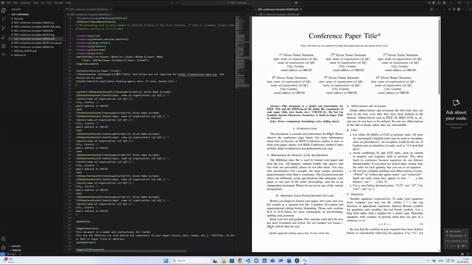

# IEEE LaTeX Setup 2025

A **LaTeX environment setup for Windows** using **VS Code** as the main editor.  
This script automates the installation checks, fixes MiKTeX issues, downloads official IEEE templates, and compiles your first PDF — all in one go.

---

## 📖 Backstory

I started this project after seeing my old masters project was hitting the limits of **Overleaf**.  
Compiling became painfully slow, and my master project was too large to recompile without paying for a premium plan.  

That was the perfect excuse for me to finally set up a **local LaTeX workflow**:  
- Faster compilation  
- Full control of dependencies  
- No internet dependency (unless you need to push updates with git)
- Works seamlessly with **VS Code**  

This script is the result: a **few step-setup** for IEEE papers on Windows.

---

## 🚀 Getting Started (Windows)

### Step 1 – Install MiKTeX
Download and install from:  
👉 [https://miktex.org/download](https://miktex.org/download)

### Step 2 – Install Git
Download and install from:  
👉 [https://git-scm.com/downloads/win](https://git-scm.com/downloads/win)

### Step 3 – Install Strawberry Perl
Download and install from:  
👉 [https://strawberryperl.com/](https://strawberryperl.com/)

### Step 4 – Install VS Code
Download and install from:  
👉 [https://code.visualstudio.com/](https://code.visualstudio.com/)

### Step 5 – Install LaTeX Workshop Extension
In VS Code:  
- Open Extensions (Ctrl + Shift + X)  
- Search for **LaTeX Workshop**  
- Install it  

### Step 6 – Run the Setup Script
- Right‑click `setup.ps1`  
- Select **“Run with PowerShell”**  
- The script will:  
  - Check MiKTeX + Perl  
  - Fix MiKTeX script engines  
  - Let you choose an IEEE template  
  - Download and extract it into a project folder  
  - Compile the first PDF  
  - Open the project in VS Code  

---

## 📂 Template Options

When running the script, you can choose between:

1. **IEEE Conference Template**  
   For conference proceedings and workshop papers.  

2. **IEEE Journal/Transaction Template**  
   For journal articles and scientific papers.  

3. **IEEE Access Template**  
   For IEEE Access journal submissions.  

Each template is saved in its own folder inside the script directory:  
- `IEEE-Conference/`  
- `IEEE-Journal/`  
- `IEEE-Access/`  

---

## 🖥️ Example Run

```text
+====================================================================+
|                       IEEE LATEX SETUP 2025                        |
|                          BY HUGO MARKOFF                           |
| (Takes credit if it works but takes no responsibility if it fails) |
|                                                                    |
+====================================================================+

Setup will create project in: C:\Users\Hugo\Documents\VSCode_LaTeX
=== Checking Prerequisites ===
[OK] MiKTeX is installed
[OK] Perl is installed: This is perl 5, version 40, subversion 2 (v5.40.2)
=== Updating MiKTeX Configuration ===
[OK] latexmk package ensured
[OK] Script engines updated

Available IEEE LaTeX Templates:
[1] IEEE Conference Template
[2] IEEE Journal/Transaction Template
[3] IEEE Access Template
[Q] Quit

Select template (1-3, Q to quit): 1
=== Setting Up IEEE Conference Template ===
[OK] Template ready: IEEE-Conference
[OK] Main file: IEEE-conference-template-062824.tex
=== Compiling LaTeX Document ===
[OK] Document compiled successfully with latexmk
[OK] Project opened in VS Code

=== Setup Complete ===
Template: IEEE Conference Template
Project location: C:\Users\Hugo\Documents\VSCode_LaTeX\IEEE-Conference
Main TeX file: IEEE-conference-template-062824.tex
[OK] PDF compiled successfully!
Your IEEE paper template is ready for editing!
```

---

## ⚡ Features

- Automatic **MiKTeX fixes** (latexmk, script engines)  
- Downloads **official IEEE templates**  
- Compiles your first PDF automatically  
- Opens project in **VS Code**  
- Clean project folders (`IEEE-Conference`, `IEEE-Journal`, `IEEE-Access`)  
- Auto‑closes terminal on success  

---


## 🎥 Demo (GIF Preview)



---

## 🙌 Credits

Created by **Hugo Markoff**  
- Takes credit if it works  
- Takes no responsibility if it fails 😉  

---

## ✅ Why This Script?

- No more Overleaf slowness  
- No more premium paywalls  
- Full local control  
- IEEE templates ready in seconds  

---